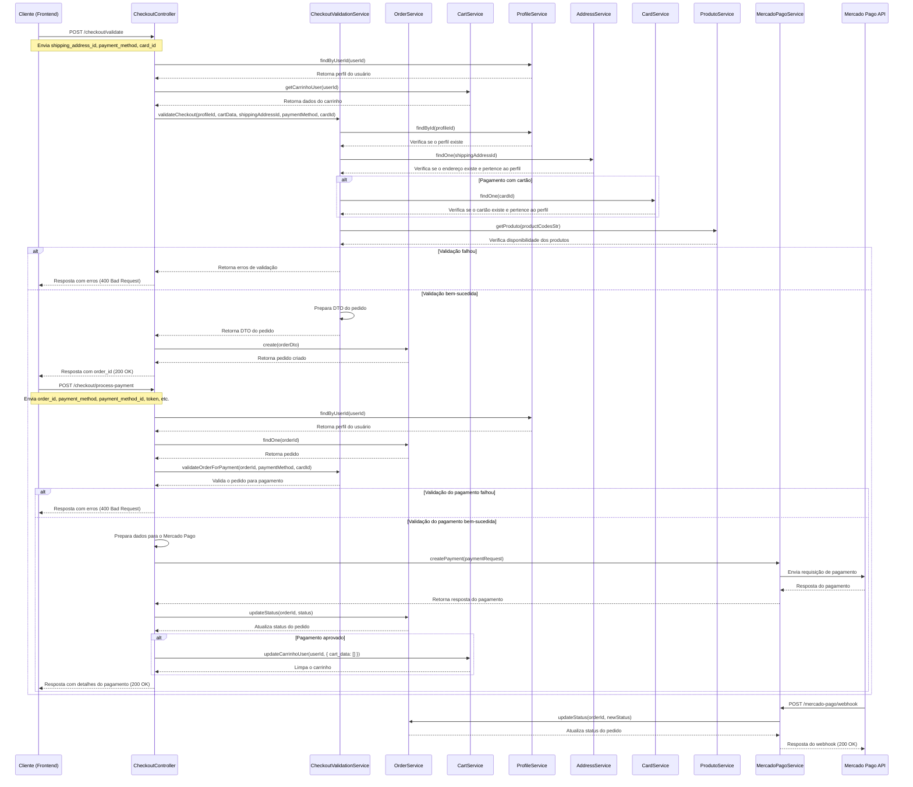

# Diagrama de Sequência do Checkout

O diagrama abaixo ilustra o fluxo completo do processo de checkout, desde a validação até o processamento do pagamento.

## Explicação do Fluxo

1. **Validação do Checkout**:
   - O cliente envia os dados do checkout para o endpoint `/checkout/validate`
   - O sistema valida todos os aspectos do checkout
   - Se a validação for bem-sucedida, um pedido é criado
   - O ID do pedido é retornado para o cliente

2. **Processamento do Pagamento**:
   - O cliente envia os dados do pagamento para o endpoint `/checkout/process-payment`
   - O sistema valida o pedido e os dados do pagamento
   - O pagamento é processado através do Mercado Pago
   - O status do pedido é atualizado com base na resposta do pagamento
   - Se o pagamento for aprovado, o carrinho é limpo
   - Os detalhes do pagamento são retornados para o cliente

3. **Webhook (Assíncrono)**:
   - O Mercado Pago envia notificações de mudanças no status do pagamento
   - O sistema processa a notificação e atualiza o status do pedido
   - Isso permite acompanhar pagamentos pendentes (como PIX e boleto) 